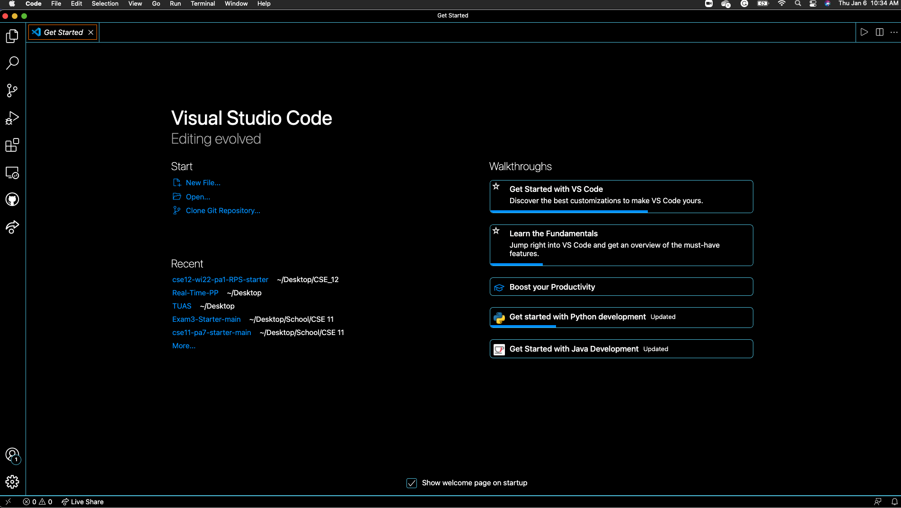
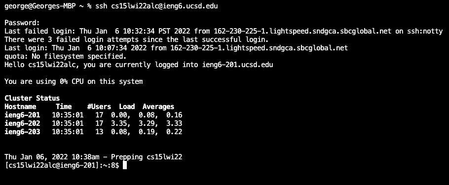
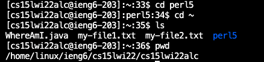
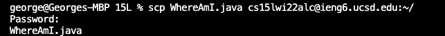
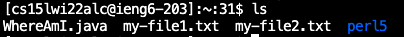
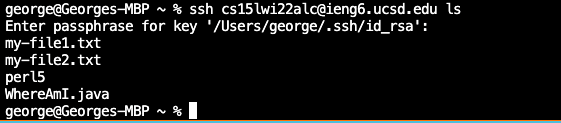

 
<u>Lab Report 1</u> 

 
<u>Step 1: Download Visual Studio Code 1</u> 

First go to the [Visual Studio Website](https://code.visualstudio.com/) and download according to your operating system. Then open the application and get to the following screenshot.

 
 
<u>Step 2: Remotely Connecting</u> 

Look up your 15L account using [this website](https://sdacs.ucsd.edu/~icc/index.php). If its your first time, you should also change your password. After finding your account, open a new terminal in vs code (located at the top bar). Then input the following command: 

`ssh <account>@ieng6.ucsd.edu`

If its your first time logging in, type `yes` to accept. Note: There won't be any visual indication while inputting your password. You'll get to the following screenshot after logging in.

 
 
<u>Step 3: Trying Some Commands</u> 

There are a few common terminal commands. For example `cd`, `ls`, `pwd`, `mkdir`, and `cp`. Here are some examples of it running.

 
 
<u>Step 4: Moving Files with scp</u> 

Like `ssh`, `scp` is another client side command we can use to move files from our client to the server. After creating a file called `WhereAmI.java`, input the following command:

`scp WhereAmI.java <account>@ieng.ucsd.edu`

If done correctly, you'll see the following:

If you login again and type `ls` you can see the `WhereAmI.java` file has successfully been moved.

 
 
<u>Step 5: Setting an SSH Key</u> 

It becomes pretty tedious to constantly type a long password each time you want to login or move a file. A solution to this process is using ssh keys. We can generate a public and private key using the command `ssh-keygen`. You'll see the following screenshot:

We save the file at `/Users/<user>/.ssh/id_rsa`. Although not necessary, you can add a passphrase if you want. Within the server, we now make a `.ssh` directory by running the command `mkdir .ssh`. Then, after logging out, we run the following command:

`scp /Users/<user>/.ssh/id_rsa.pub <account>@ieng6.ucsd.edu:~/.ssh/authorized_keys`

Now you can access the server without having to type your password each time.

 
 
<u>Step 6: Optimizing Remote Running</u> 

Although logging in and out has been made easier, it is sometimes still tedious just login and run a single command. Therefore, we can run commands such as `ssh <account>@ieng6.ucsd.edu ls` to access the server without fully logging in. The following is an example.

