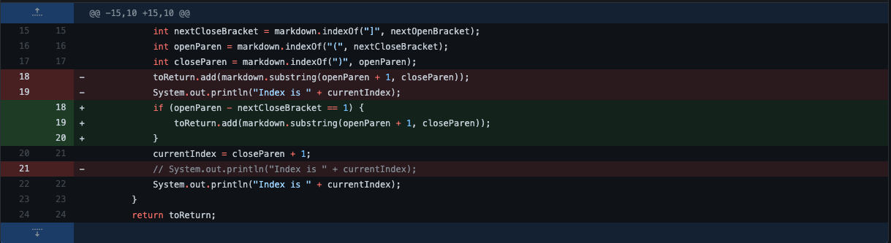
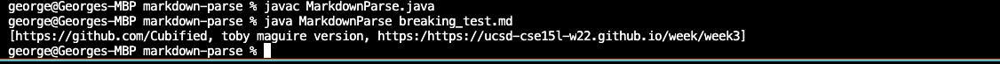
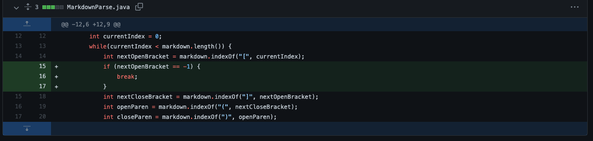
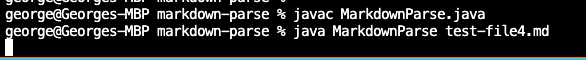
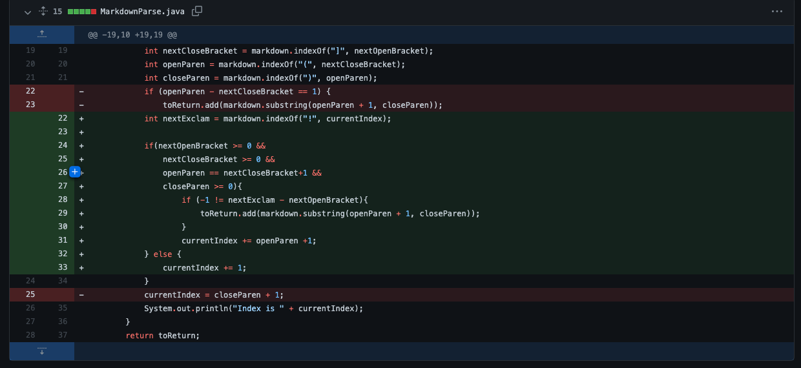
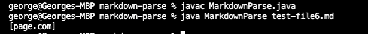

# Lab Report 2

## Bug 1: Not filtering out gaps between bracket and parenthesis

Here is the [input test file](https://github.com/ghwusd/markdown-parse/blob/main/breaking_test.md)
that induced the failure. 

The following is a screenshot of the code changes:

The following is a screenshot of the program picking up "toby maguire version" as a link:

With the current algorithm, any pair of brackets followed by a pair of parethesis will be picked up as a link.
In this specific test file, "toby maguire version" registers as a link because it is contained within a pair of parenthesis after a pair of brackets.
The solution is to check that the closing bracket is one index less than the next open parethesis.

## Bug 2: Infinite loop
Here is the [input test file](https://github.com/ghwusd/markdown-parse/blob/main/test-file4.md)
that induced the failure. 

The following is a screenshot of the code changes:

The following is a screenshot of the the infinite loop:

The current algorithm increments by the index of openParen plus 1.
However if there are empty spaces at the end of the file, it goes into an infinite loop because it incremets by either a fixed value or -1.
The solution to this problem is simply to break from the loop if nextOpenBracket is equal to -1, indicating there are no more links in the file.

## Bug 3: Not filtering out images
Here is the [input test file](https://github.com/ghwusd/markdown-parse/blob/main/test-file6.md)
that induced the failure.

The following is a screenshot of the code changes:

The following is a screenshot of the program picking up images as links:

Images and Links have very similar tags. Therefore, our current algorithm thinks images are also links.
The solution to this problem is to check for exclamation marks within the file and only adds a link if the index before the open bracket isn't an exclamation mark.

