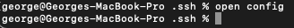
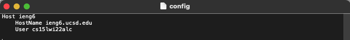
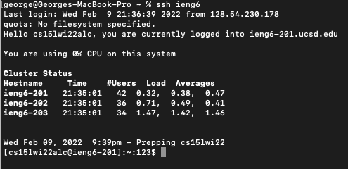
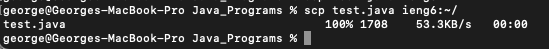

# Lab Report 3

## Choice 1: Streamling ssh Configuration

The first step I took was going to the `.ssh` directory on my local computer and typing the command `touch config`.
This command creates a new file named config.
Then, I use the command `open config` to open the file as seen in the following screenshot.

After opening up the file, I pasted the following text:

After saving the file, I could ssh into my account with the command `ssh ieng6`. 
This is what it looks like.

Now, I can run ssh related commands like `scp` without having to type my whole ieng6 account.
Here, I am copying over a file called `test.java` onto my ieng6 account.

