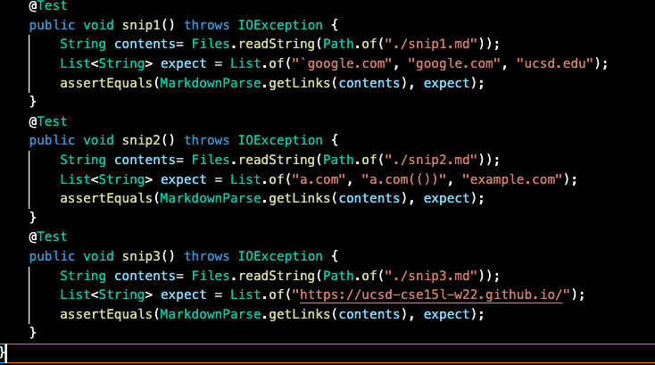
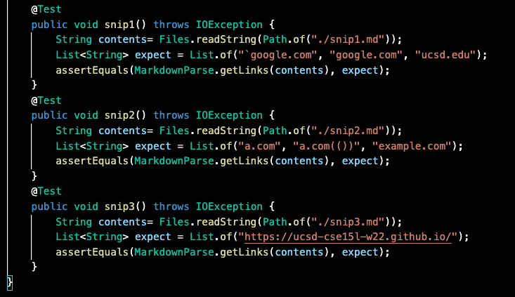
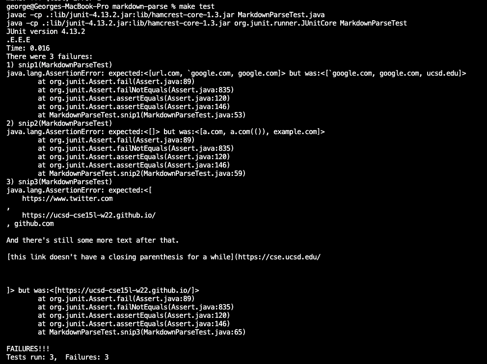
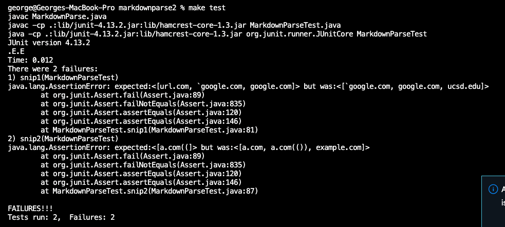
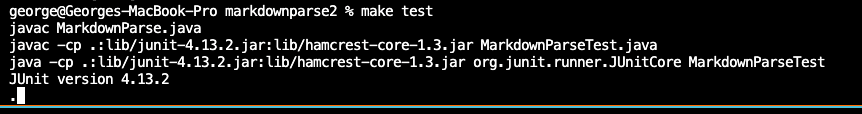

# Lab Report 3

## JUnit Code:

My Implementaiton Test Cases:

Reviewed Code Test Cases:

## JUnit Output for My Implementation:

## JUnit Ouput for Reviewed Implementation:
Snips are broken up because there is an infinite loop in the third JUnit test.

Tests for the first two snips:

Test for the third snip:

## Snippet 1:

Yes, I think there can be a relatively quick fix to the backtick problem.
The first change would come from throwing out any links with a backtick preceding the open bracket.
The second change would come from treating the backticks as quotes and allowing any brackets within the link descriptor if it were contained within backticks.

## Snippet 2:

No, I don't think there is a relatively quick fix for all the bracket and parenthesis cases.
Currently, there aren't any checkers for pending open and closed brackets so implementing such a system would require large code changes.

## Snippet 3:

Yes, I think there can be a relatively quick fix to the newline bugs.
Within each possible link, I need to check if there are any newlines present.
If there aren't, I can just use the trim method to get rid of the blank spaces in front and behind the link.
If there are, I can just throw out the link.