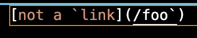
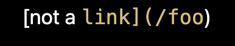
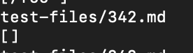
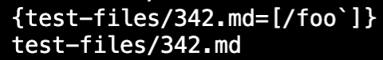
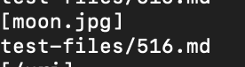
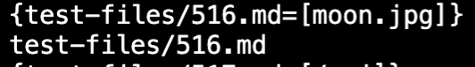

# Lab Report 5

Since I'm only looking for two code differences, I opted to manually find these two tests.
If I needed to record all differences, I likely would'ved used the `diff` command.

## Test 342
Here is test 342:

Here is the actual output:

Here is what my markdown-parse returns:

Here is what the cloned markdown-parse returns:

As you can see both versions of markdown-parse are wrong.
Even though in reality there is no link, both still return a non-zero list. 
The change I can make to my own markdown parse is to implement a system that prioritizes ticks.
The system would check for a tick within a set of brackets and see if there was another tick with a greater index.
If so, the loop would jump the index to the tick with the larger index. 
Then, the program would continue searching for links.

## Test 516

Here is test 516:

Here is the actual output:

Here is what my markdown-parse returns:

Here is what the cloned markdown-parse returns:

As you can see both versions of markdown-parse are wrong. The real link is `/url`.
However both return `moon.jpg`.
This test showcases that images can also be clicked as links.
The first code change I would make is to implement image detection.
As my markdown-parse returned `moon.jpg` this implies, the program still believed `` was a link. 
I would do this by checking for exclamation marks infront of potential links.
After that, I will look for every single image and check if there are appropriate brackets surrounding that image followed by a set of parenthesis.
If all this is fulfilled, the text contained within the parenthsis is a link.

