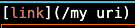
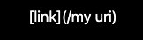
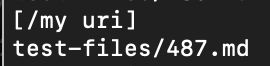
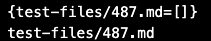
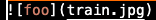
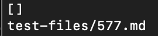
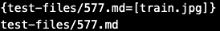

# Lab Report 5

Since I'm only looking for two code differences, I opted to manually find these two tests.
If I needed to record all differences, I likely would'ved used the `diff` command.

## Test 487

Here is test 487:

Here is the actual output:

Here is what my markdown-parse returns:

Here is what the cloned markdown-parse returns:

As you can see my mark-down failed this test case because even though there isn't a link my markdown-parse still returned a non-zero list.
The content within the parenthesis isn't considered a link because it contains a space.
Therefore, the code change I would make is to first use the method `trim()` to remove white space at the beginning and end of the potential link.
Then, I would check for if there was a white space still within the potential link.
If there is, that means it isn't a link. If there isn't, that means it is still a potential link.

## Test 577
Here is test 577:

Here is the actual output:

Here is what my markdown-parse returns:

Here is what the cloned markdown-parse returns:

As you can see the cloned markdown parse is wrong.
Even though there is no link, the clone markdown parse returns a non-zero list.
The problem is that the cloned markdown parse views images as still links.
The change I would make is to simply check for the char right before the open bracket of any potential link.
If that char is an exclamation point, that means it is an image and not a link and shouldn't be added.

